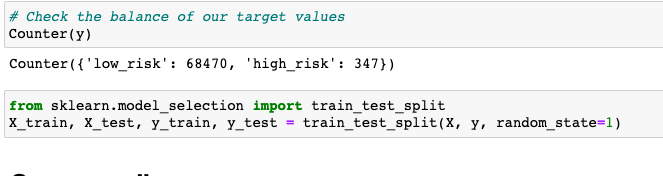
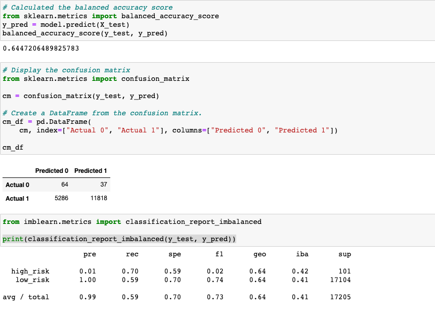
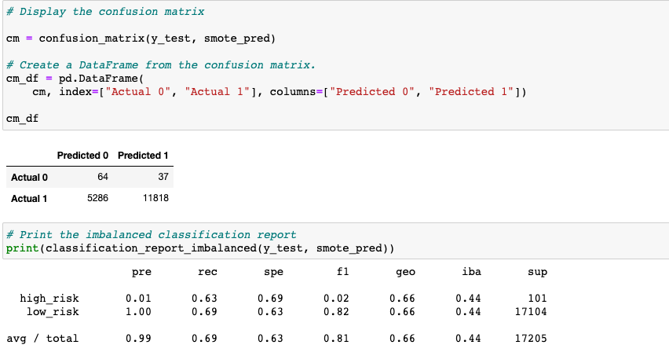
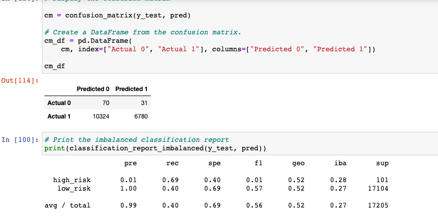
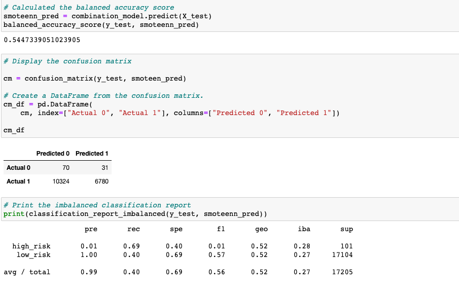
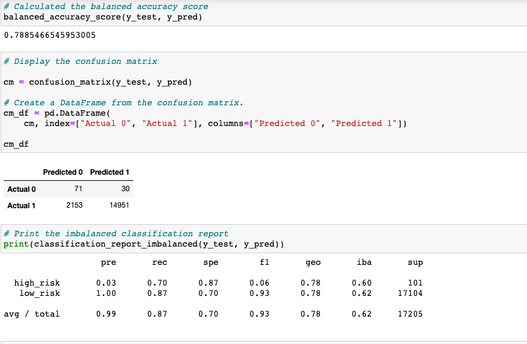
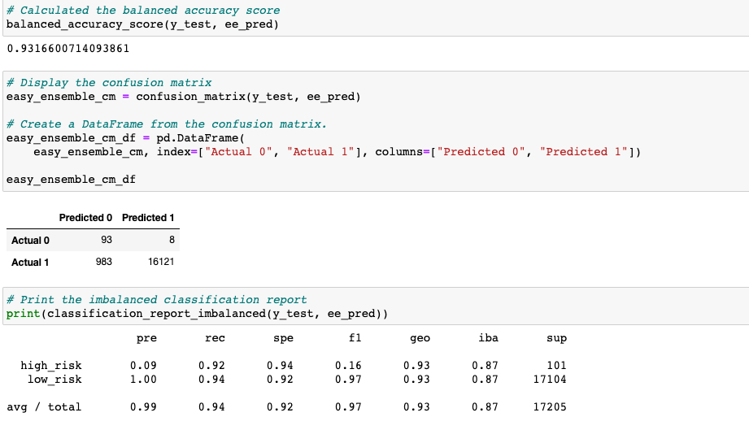

# Credit_Risk_Analysis
Analyzing credit risk with supervised machine learning rooted in python.
<br/>
<p align="center">Tyrone Fraley<br/>
UC Berkley Extension<br/>
Jan 4, 2023<br/>
<p/>
<br/>
<p align="center">
  
</p>
<br/>

## Overview of the Analysis

In 2019, there were more than 19 million Americans who had at least a single unsecured personal loan. With such a high number there was exponential growth within personal lending that exceeded credit card, mortgage, and auto debt. Working with FinTech firms, our goal is to stay ahead of traditional loan processes. To do this I used supervised machine learning to analyze large amounts of data and predict trends to make the lending process more efficient. 
Within credit risk there is an unbalanced classification problem, considering good loans exceed risky loans. To alleviate this issue I used different techniques to train and evaluate models based on unbalanced classes. This involved the use of imbalanced-learn and scikit-learn libraries. Both of which would allow me to evaluate and build models using resampling methods. 
Gathering the credit card dataset from LendingClub (peer-to-peer lending services company). I had to oversample the data by using RandomOverSampler and SMOTE algorithms. I then undersampled the data using the ClusterCentroids algorithm. From here it was important to use a combinatorial approach to over and undersample the data using the SMOTEEN algorithm. Finally, I compared the two machine learning models for reducing bias, employed EasyEnsembleClassifier and BalancedRandomForestClassifier, to predict any sort of credit risk.

## Results

### Credit Risk Resampling Techniques

To begin the project I used the "loan_status" as my target for the LoanStats_2019Q1.csv file. I used pandas to read in the LoanStats_2019Q1.csv file and began to clean the data first by removing any null columns. The next step was to remove the "Issued" loan status column through ``` issued_mask = df['loan_status'] != 'Issued'``` and then use df.loc[issued_mask]. Once the target column values were converted to low_risk and high_risk which was based on their values, I then checked my data types to ensure columns with any numbers were float64 datatypes.
<br/>
<p align="center">
  
</p>
<br/>
The next step in the process was to split the data into training and testing. First to begin the process I employed pd.get_dummies to convert any string variables to numeric (X = pd.get_dummies(df.drop('loan_status', axis=1))) and create my target (y = df.loc[:, 'loan_status']). I then used the counter function to check the balance of the target variables (Counter(y)). The balance for this portion of the project and begin to train and test my data.
<br/>
<p align="center">
  
</p>
<br/>

### Naive Random Oversampling Machine Learning Model

Moving forward into Naive Random Oversampling machine learning model. I started to resample the data with the RandomOverSampler. The random_state was set to 1 before administering the Counter() function when X and y were resampled from the train data. Before moving into the balanced accuracy score I trained the logistic regression model using the resampled data (model.fit(X_resampled, y_resampled)). The balanced accuracy score for this portion of the project came up with 0.64 which is okay, but not the greatest. According to Allwright (2022), "Between 0.6 and 0.7 - OK." 
The confusion matrix was next up for this portion of the project. According to Narkhede(2018), "it is extremely useful for measuring Recall, Precision, Specificity, Accuracy, and most importantly AUC-ROC curves.."Upon running the confusion matrix the yeilded results reflected TP: 64, FP: 37, FN: 5286, and TN: 11818. Which means there is a total of 5,350 true positives. Which then when plugged into a classification report imbalanced model the high risk category had a precision score of 0.01 and a recall score of 0.70. For the low risk category the precision score was 1.00 and the recall score was 0.59. With averages at 0.99 for precision score and 0.59 for the recall score. According to Scikit-learn.org (N.D.), "the best value is 1 and the worst value is 0." In this instance the recall score for high_risk and low risk are above 0.5. Knowing that 1.0 is the best both recall scores are somewhat favorable. However, it should be noted that the recall score of 0.59 is barely favorable compared to the high risk recall score of 0.70 to accurately gather the amount of positive cases that were predicted correctly. According to Kanstren, (2020), "recall is a measure of how many of the positive cases the classifier correctly predicted, over all the positive cases in the data." However, when analyzing the precision score for the data the high risk score was not favorable at 0.01 and the low risk score was favorable at 1.00.
<br/>
<p align="center">
  
</p>
<br/>

### SMOTE Oversampling Machine Learning Model

The next machine learning model was the SMOTE Oversampling model. The process was the same for the most part when compared to the previous machine learning model. However, it took  some extra coding in the resampling phase:

    ``` 
    X_resampled, y_resampled = SMOTE(random_state=1, sampling_strategy=1.0).fit_resample(
    X_train, y_train
    )
    
    ```
The balanced score for the SMOTE oversampled model was not too bad at 0.66. When plugged into a confusion matrix the values were as follows: TP 64, FP 37, FN 5286, and TN 11818. Which is the same as the Naive Random Oversampling machine learning model. Note, the precision scores are also the same, but the recall scores are not. Recall for high risk was 0.63 and recall for low risk was 0.69. Not the best recall scores nor for the high risk precision score, but the recall scores are still at an okay level.  
<br/>
<p align="center">
  
</p>
<br/>

### Undersampling Machine Learning Model

Upon creation of the Undersampling machine learning model I used similar steps to that of the Naive Oversampling machine learning model. Once the balanced accuracy score was processed with a score of 0.54 which was just above 0.5. However, the confusion matrix identified 70 TP's, 31 FP's, 10324 FN's, and 6780 TN's. At first glance this may seem like favorable results. The model was able to identify more FN's and TP's than the Naive Oversampling and the SMOTE Oversampling machine learning models. Precision scores remained the same.

<br/>
<p align="center">
  
</p>
<br/>

### Combination (Over and Under) Sampling Machine Learning Model

The fourth model was the CoCombination (Over and Under) Sampling machine learning model. This model utilized SMOTEENN. Interestingly enough this model produced the same results as the Undersampling machine learning model. 

<br/>
<p align="center">
  
</p>
<br/>

### Ensemble Learners

The Ensemble Learners file started the same way as the resample file. In that the initial code needed to pull data from a csv file and then begin to train and teest the data was the same. This file includes two more machine learning models. 

### Balanced Random Forest Classifier Machine Learning Model

By importing the balanced random forest classifier I was ready to begin to build a new machine learning model. This model yeilded a balanced accuracy score of 78. The highest I have seen thus far in the project. Not to mention once plugged into a confusion matrix the model had TP at 71, FP at 30, FN at 2153, and TN at 14951. Moving forward into the classifcation report the recall for high risk was 0.7 and 0.87 for low risk. The precision score for high risk was 0.03 and 1.00 for low risk. This model yeilded the best results thus far. 

<br/>
<p align="center">
  
</p>
<br/>

Once this portion of creating the machine learning model was complete. I wanted to view the list of features. I printed the features in descending order by feature importance.

```
[(0.07876809003486353, 'total_rec_prncp'),
 (0.05883806887524815, 'total_pymnt'),
 (0.05625613759225244, 'total_pymnt_inv'),
 (0.05355513093134745, 'total_rec_int'),
 (0.0500331813446525, 'last_pymnt_amnt'),
 (0.02966959508700077, 'int_rate'),
 (0.021129125328012987, 'issue_d_Jan-2019'),
 (0.01980242888931366, 'installment'),
 (0.01747062730041245, 'dti'),
 (0.016858293184471483, 'out_prncp_inv'),
 (0.01641297102011915, 'total_bal_ex_mort'),
 (0.015220714904737209, 'mths_since_recent_inq'),
 (0.015115240704562424, 'issue_d_Mar-2019'),
 (0.014926655663448373, 'revol_bal'),
 (0.014899352873994727, 'max_bal_bc'),
 (0.014881069023035237, 'out_prncp'),
 (0.014859446582326507, 'mo_sin_old_rev_tl_op'),
 (0.014832564501144122, 'annual_inc'),
 (0.014613819728800227, 'bc_util'),
 (0.014487685026878092, 'tot_hi_cred_lim'),
 (0.013921085423763812, 'mo_sin_old_il_acct'),
 (0.013534131593418711, 'mths_since_rcnt_il'),
 (0.013364759441576994, 'total_rev_hi_lim'),
 (0.01332289882475225, 'avg_cur_bal'),
 (0.013265926832893358, 'bc_open_to_buy'),
 (0.01311545089813887, 'il_util'),
 (0.01304530062898567, 'total_bc_limit'),
 (0.0130446065288952, 'all_util'),
 (0.013030046723135838, 'pct_tl_nvr_dlq'),
 (0.012855901280381887, 'tot_cur_bal'),
 (0.01279908506759016, 'total_il_high_credit_limit'),
 (0.012773576514405109, 'inq_last_12m'),
 (0.011968994260747247, 'total_bal_il'),
 (0.010982948025240226, 'mo_sin_rcnt_tl'),
 (0.010579906006851516, 'loan_amnt'),
 (0.010575363106694519, 'mths_since_recent_bc'),
 (0.010320067009550682, 'num_rev_accts'),
 (0.010209212170253059, 'total_acc'),
 (0.009753839399393215, 'open_acc_6m'),
 (0.009662050208879065, 'num_il_tl'),
 (0.009632472481996241, 'num_actv_rev_tl'),
 (0.009393346012674945, 'mo_sin_rcnt_rev_tl_op'),
 (0.00872448189550355, 'num_bc_tl'),
 (0.008628938824946404, 'num_sats'),
 (0.008330966254402506, 'num_op_rev_tl'),
 (0.007570544824579072, 'num_bc_sats'),
 (0.007548811505974241, 'num_tl_op_past_12m'),
 (0.007489717491934961, 'open_act_il'),
 (0.007382231721841728, 'open_acc'),
 (0.007272665006598051, 'num_rev_tl_bal_gt_0'),
 (0.006998827313196186, 'total_rec_late_fee'),
 (0.006866662924995743, 'num_actv_bc_tl'),
 (0.006714495620628373, 'acc_open_past_24mths'),
 (0.006561432872333855, 'open_il_24m'),
 (0.006240598451492287, 'inq_fi'),
 (0.006216409633238659, 'inq_last_6mths'),
 (0.0061708920490257954, 'mort_acc'),
 (0.006083218608279307, 'total_cu_tl'),
 (0.005640206440873574, 'issue_d_Feb-2019'),
 (0.005634546230136711, 'open_rv_24m'),
 (0.005131046989565006, 'percent_bc_gt_75'),
 (0.005106000423451099, 'next_pymnt_d_Apr-2019'),
 (0.005036652777545191, 'next_pymnt_d_May-2019'),
 (0.004860024796675963, 'open_il_12m'),
 (0.004198582835532627, 'tot_coll_amt'),
 (0.004018916067963884, 'open_rv_12m'),
 (0.0037571920083085985, 'num_accts_ever_120_pd'),
 (0.003082852259926947, 'delinq_2yrs'),
 (0.0029133221443170495, 'home_ownership_RENT'),
 (0.002824523629114469, 'home_ownership_OWN'),
 (0.002204946377565813, 'verification_status_Not Verified'),
 (0.0020912385738361574, 'application_type_Joint App'),
 (0.002015258269512615, 'pub_rec'),
 (0.0019325773153555006, 'verification_status_Verified'),
 (0.001901604006185586, 'application_type_Individual'),
 (0.0015046400907840708, 'verification_status_Source Verified'),
 (0.0014589723334940362, 'home_ownership_MORTGAGE'),
 (0.0013727925120781853, 'pub_rec_bankruptcies'),
 (0.0011520703643731528, 'initial_list_status_w'),
 (0.0011005704165634263, 'initial_list_status_f'),
 (0.0009956935704327383, 'num_tl_90g_dpd_24m'),
 (0.0007150315534652695, 'collections_12_mths_ex_med'),
 (0.0004955956183545533, 'home_ownership_ANY'),
 (0.0002730803587770788, 'chargeoff_within_12_mths'),
 (0.0, 'tax_liens'),
 (0.0, 'recoveries'),
 (0.0, 'pymnt_plan_n'),
 (0.0, 'policy_code'),
 (0.0, 'num_tl_30dpd'),
 (0.0, 'num_tl_120dpd_2m'),
 (0.0, 'hardship_flag_N'),
 (0.0, 'delinq_amnt'),
 (0.0, 'debt_settlement_flag_N'),
 (0.0, 'collection_recovery_fee'),
 (0.0, 'acc_now_delinq')]
 ```

### Easy Ensemble AdaBoost Classifier Machine Learning Model

The final machine learning model in this project was the Easy Ensemble AdaBoost Classifier machine learning model. Although the Balanced Random Forest Classifier machine learning model seemed the most favorable thus far. The Easy Ensemble AdaBoost Classifier model actually produced the best results. With a balance score of 0.93 this model was already beginning to look great. The confusion matrix produced TP at 93, FP at 8, FN at 983, and TN at 16121. When observing the precision and recall scores the high risk precision score was 0.09 and the recall score was 0.92. Both results for the high risk category outperformed the other machine learning models. The low risk category yeilded a precision score of 1.00 and a recall score of 0.94. This model is clearly the winner.

<br/>
<p align="center">
  
</p>
<br/>

### All ML Models


*Naive Random Oversampling Machine Learning Model
  * Balance Score: 0.64
  * High Risk PRE: 0.01
  * High Risk REC: 0.70
  * Low Risk PRE: 1.00
  * Low Risk REC: 0.59

*SMOTE Oversampling Machine Learning Model
  * Balance Score: 0.66
  * High Risk PRE: 0.01
  * High Risk REC: 0.63
  * Low Risk PRE: 1.00
  * Low Risk REC: 0.69

*Undersampling Machine Learning Model
  * Balance Score: 0.54
  * High Risk PRE: 0.01
  * High Risk REC: 0.69
  * Low Risk PRE: 1.00
  * Low Risk REC: 0.40

*Combination (Over and Under) Sampling Machine Learning Model
  * Balance Score: 0.54
  * High Risk PRE: 0.01
  * High Risk REC: 0.69
  * Low Risk PRE: 1.00
  * Low Risk REC: 0.40

*Balanced Random Forest Classifier Machine Learning Model
  * Balance Score: 0.78
  * High Risk PRE: 0.03
  * High Risk REC: 0.70
  * Low Risk PRE: 1.00
  * Low Risk REC: 0.87

*Easy Ensemble AdaBoost Classifier Machine Learning Model
  * Balance Score: 0.93
  * High Risk PRE: 0.09
  * High Risk REC: 0.92
  * Low Risk PRE: 1.00
  * Low Risk REC: 0.94
  
  

## Summary

The results of this project could allow one to surmise that the Easy Ensemble AdaBoost Classifier machine learning model was the most favorable. This is because the balanced score was 0.93, High Risk pre score was 0.09, High Risk rec score was 0.92, Low Risk pre score was 1.00, and the Low Risk rec score was 0.94. All scores were the highest for this model than any other machine learning model in this project making it the best at accurately gathering positive values in the data set.

## References:

Allwright, S. (2022, May 21). "What is a good balanced accuracy score? Simply explained". https://stephenallwright.com/balanced-accuracy/#:~:text=Much%20like%20accuracy%2C%20balanced%20accuracy,Between%200.7%20and%200.9%20%2D%20Good

Scikit-learn.org. (N.D.). "sklearn.metrics.recall_score". https://scikit-learn.org/stable/modules/generated/sklearn.metrics.recall_score.html

Narkhede, S. (2018, May 9). "Understanding Confusion Matrix". https://towardsdatascience.com/understanding-confusion-matrix-a9ad42dcfd62

Kanstren, T. (2020, Sep 11). "A Look at Precision, Recall, and F1-Score". https://towardsdatascience.com/a-look-at-precision-recall-and-f1-score-36b5fd0dd3ec"
