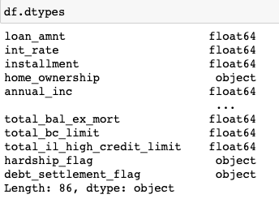

# Credit_Risk_Analysis
Analyzing credit risk with supervised machine learning rooted in python.
<br/>
<p align="center">Tyrone Fraley<br/>
UC Berkley Extension<br/>
Jan 4, 2023<br/>
<p/>
<br/>
<p align="center">
  
</p>
<br/>

## Overview of the Analysis

In 2019, there were more than 19 million Americans who had at least a single unsecured personal loan. With such a high number there was exponential growth within personal lending that exceeded credit card, mortgage, and auto debt. Working with FinTech firms, our goal is to stay ahead of traditional loan processes. To do this I used supervised machine learning to analyze large amounts of data and predict trends to make the lending process more efficient. 
Within credit risk there is an unbalanced classification problem, considering good loans exceed risky loans. To alleviate this issue I used different techniques to train and evaluate models based on unbalanced classes. This involved the use of imbalanced-learn and scikit-learn libraries. Both of which would allow me to evaluate and build models using resampling methods. 
Gathering the credit card dataset from LendingClub (peer-to-peer lending services company). I had to oversample the data by using RandomOverSampler and SMOTE algorithms. I then undersampled the data using the ClusterCentroids algorithm. From here it was important to use a combinatorial approach to over and undersample the data using the SMOTEEN algorithm. Finally, I compared the two machine learning models for reducing bias, employed EasyEnsembleClassifier and BalancedRandomForestClassifier, to predict any sort of credit risk.

## Results

### Credit Risk Resampling Techniques

To begin the project I used the "loan_status" as my target for the LoanStats_2019Q1.csv file. I used pandas to read in the LoanStats_2019Q1.csv file and began to clean the data first by removing any null columns. The next step was to remove the "Issued" loan status column through ``` issued_mask = df['loan_status'] != 'Issued'``` and then use df.loc[issued_mask]. Once the target column values were converted to low_risk and high_risk which was based on their values, I then checked my data types to ensure columns with any numbers were float64 datatypes.
<br/>
<p align="center">
  
</p>
<br/>
The next step in the process was to split the data into training and testing. First to begin the process I employed pd.get_dummies to convert any string variables to numeric ``` X = pd.get_dummies(df.drop('loan_status', axis=1)) ``` and create my target ``` y = df.loc[:, 'loan_status'] ```. I then used the counter function to check the balance of the target variables (Counter(y)). The balance for this portion of the project and begin to train and test my data. 
<br/>
<p align="center">
  
</p>
<br/>
Moving forward into over sampling I started to resample the data with the RandomOverSampler. The random_state was set to 1 before administering the Counter() function when X and y were resampled from the train data. Before moving into the balanced accuracy score I trained the logistic regression model using the resampled data (model.fit(X_resampled, y_resampled)). The balanced accuracy score for this portion of the project came up with 0.64 which is okay, but not the greatest. According to Allwright (2022), "Between 0.6 and 0.7 - OK." 
The confusion matrix was next up for this portion of the project. According to Narkhede(2018), "it is extremely useful for measuring Recall, Precision, Specificity, Accuracy, and most importantly AUC-ROC curves.."Upon running the confusion matrix the yeilded results reflected TP: 64, FP: 37, FN: 5286, and TN: 11818. Which means there is a total of 5,350 true positives. Which then when plugged into a classification report imbalanced model the high risk category had a precision score of 0.01 and a recall score of 0.70. For the low risk category the precision score was 1.00 and the recall score was 0.59. With averages at 0.99 for precision score and 0.59 for the recall score. According to Scikit-learn.org (N.D.), "the best value is 1 and the worst value is 0." In this instance the recall score for high_risk and low risk are above 0.5. Knowing that 1.0 is the best both recall scores are somewhat favorable. However, it should be noted that the recall score of 0.59 is barely favorable compared to the high risk recall score of 0.70 to accurately gather the amount of positive cases that were predicted correctly. According to Kanstren, (2020), "recall is a measure of how many of the positive cases the classifier correctly predicted, over all the positive cases in the data." However, when analyzing the precision score for the data the high risk score was not favorable at 0.01 and the low risk score was favorable at 1.00.
<br/>
<p align="center">
  
</p>
<br/>
The next machine learning model was the SMOTE Oversampling model. The process was the same for the most part when compared to the previous machine learning model. However, it took  some extra coding in the resampling phase:

    ``` 
    X_resampled, y_resampled = SMOTE(random_state=1, sampling_strategy=1.0).fit_resample(
    X_train, y_train
    )
    
    ```

## Summary


##References:

Allwright, S. (2022, May 21). "What is a good balanced accuracy score? Simply explained". https://stephenallwright.com/balanced-accuracy/#:~:text=Much%20like%20accuracy%2C%20balanced%20accuracy,Between%200.7%20and%200.9%20%2D%20Good

Scikit-learn.org. (N.D.). "sklearn.metrics.recall_score". https://scikit-learn.org/stable/modules/generated/sklearn.metrics.recall_score.html

Narkhede, S. (2018, May 9). "Understanding Confusion Matrix". https://towardsdatascience.com/understanding-confusion-matrix-a9ad42dcfd62

Kanstren, T. (2020, Sep 11). "A Look at Precision, Recall, and F1-Score". https://towardsdatascience.com/a-look-at-precision-recall-and-f1-score-36b5fd0dd3ec"
